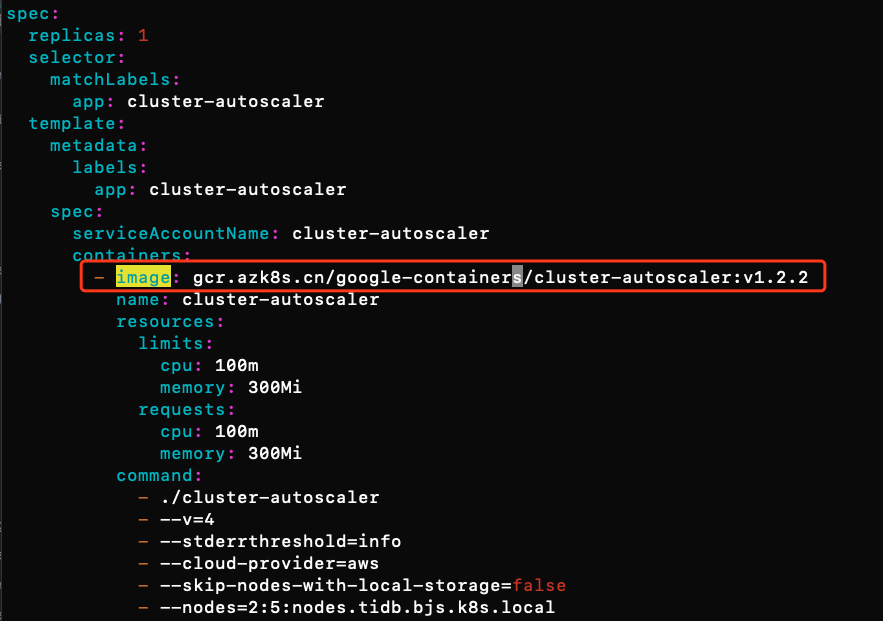
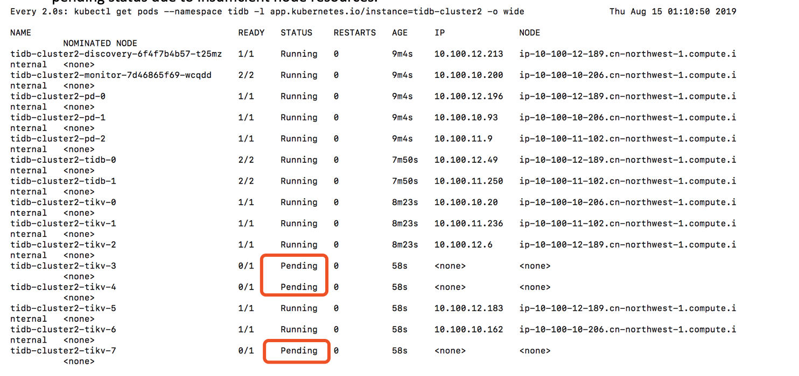
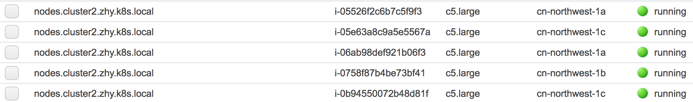
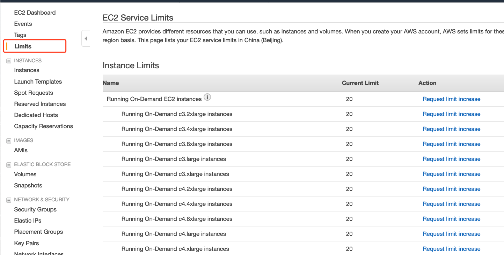
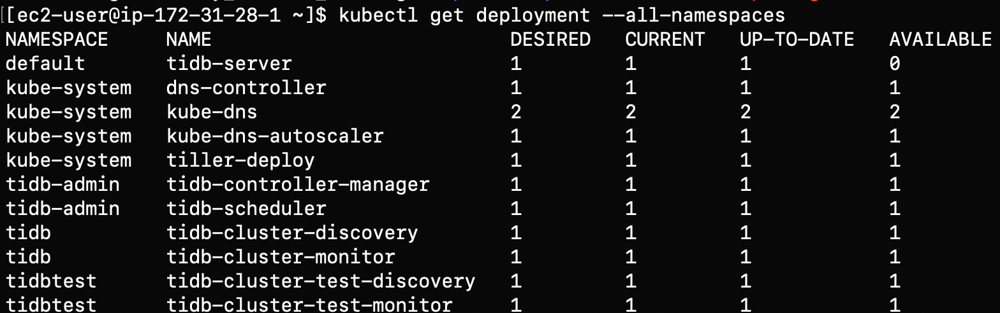

# 如何在AWS中国区搭建并部署k8s中的TiDB集群

本文介绍了如何在AWS中国区利用kubernetes环境部署TiDB集群。kubernetes的搭建利用到了[kops-cn](https://github.com/nwcdlabs/kops-cn)

## 先决条件

1. 拥有AWS中国区账号，如果还没有，[点击此处注册](https://www.amazonaws.cn/sign-up/)
1. 检查账户级别的EC2 Limits，确保你的EC2 limits多于你想要部署的node的数量.

## 步骤1：配置跳板机
1. 启动EC2（推荐使用Amazon Linux2 AMI)
1. IAM设置：创建一个具有特定权限的User，下载credentials文档或者手动记下“Access key ID”和“Secret access key”
   
   >Note: 该权限至少需要EC2相关的权限，否则无法启动集群
   
1. 执行```aws configure```为EC2配置对应权限
   - AWS Access key ID:
   - AWS Secret access key:
   - Default Region name: cn-north-1
   - Default output format: none
   
>Note：cn-north-1为北京区的region code，如果用宁夏，应该配置为cn-northwest-1


## 步骤2：利用kops-cn创建kubernete集群
1. 点击[kops-cn](https://github.com/nwcdlabs/kops-cn)，按照Pahud的详细guide配置k8s集群。
1. (可选选项) 如果您的AWS账号已经做过ICP备案，跳过此步；如果还没有做ICP备案，您账户下的80，8080，443端口是被屏蔽的，您需要配置以下选项更改默认端口。（如果仍需要这三个端口，请同时申请备案开放这三个端口。）
   - 登录[AWS控制台](https://console.amazonaws.cn/console/home)，在服务- EC2- 负载均衡器页面，选择.kube/config 当中的负载均衡器，并且更改以下配置：
      - 添加安全组策略，允许8443端口对source:0.0.0.0/0开放。
      - 点击listeners(侦听器)选项，将443端口更改成8443.
   - 编辑.kube/config文件，在server这一行的最后添加":8443"  
1. 用kubectl命令检查集群是否配置成功
1. 安装helm和tiller，[点击此处查看详细的安装文档](https://github.com/nwcdlabs/kops-cn/blob/master/doc/Helm.md)

## 步骤3：在kubernete集群安装配置TiDB
1. ssh到跳板机,对于选择Amazon Linux镜像的用户；如选择其他镜像，请更改至对应用户名
   ```
   ssh -i <your-private-key-name>.pem ec2-user@<ip-address>
   ```
1. 如果还没有安装helm，请务必[参考此文档](https://github.com/nwcdlabs/kops-cn/blob/master/doc/Helm.md)进行安装
1. 添加pingcap到helm repo list
   ```
   helm repo add pingcap https://charts.pingcap.org/
   helm repo update
   helm search tidb
   ```
1. 安装TiDB operator
   ```
   #to create TidbCluster customized resource type:
   kubectl apply -f https://raw.githubusercontent.com/pingcap/tidb-operator/master/manifests/crd.yaml && \
   kubectl get crd tidbclusters.pingcap.com

   #to get chart yaml file of tidb-operator
   #you could customize your folder location by chaging mkdir command
   mkdir -p ~/tidb-operator && \
   helm inspect values pingcap/tidb-operator --version=<chart-version> > ~/tidb-operator/values-tidb-operator.yaml
   
   #to modify the yaml file and specify local image repo:
   vim ~/tidb-operator/values-tidb-operator.yaml
   ```
   
   将scheduler.kubeSchedulerImage替换为国内的源，"gcr.azk8s.cn/google-containers/kube-scheduler", 并保存文件。
   

   ```
   #install tidb-operator:
   helm install pingcap/tidb-operator --name=tidb-operator --namespace=tidb-admin --version=v1.0.0  -f ~/tidb-operator/values-tidb-operator.yaml

   #verify the installation:
   kubectl get po -n tidb-admin -l app.kubernetes.io/name=tidb-operator
   ```
1. 运行以下命令拿到tidb-cluster配置文件
   ```
   # fetch Tidb cluster package  
   helm fetch pingcap/tidb-cluster   

   # unzip it to get the config file
   tar -zxvf tidb-cluster-v1.0.0.tgz

   cd tidb-cluster
   ```

1. 在此文件夹下，会有一个values.yml文件。这个是tidb-cluster的配置文件，里面包含不同组件，比如TiDB，Tikv, PD的详细定义。在启动集群之前，请您自行修改至期望的配置。比如storageclass，replicaset，pvReclaimPolicy等等。下面是一些sample。
   - 将storageclass修改为gp2（一种EBS卷类型）。如您不了解EBS, 请参考[EBS卷类型的定义和区别](https://docs.aws.amazon.com/zh_cn/AWSEC2/latest/UserGuide/EBSVolumeTypes.html)获取更多信息。   
    
    > 【重要】: 对于只支持EBS的实例类型，如c4,c5等，我们需要将所有默认的local-instance更改至一种EBS类型。请点击[EC2实例类型介绍](https://aws.amazon.com/ec2/instance-types/)，如果您不了解您选择的实例类型。
   - 更改replica的数量
   

1. 在确保已经自定义完所有所期望的配置后，运行安装命令。 namespace和name可自行替换。
   ```
   helm install pingcap/tidb-cluster --name=tidb-cluster-test --namespace=tidbtest -f values.yml 
   ```
1. 验证集群。PV和PVC应已采取dynamic的方式分配成功。可以用```kubectl get pv | grep tidbtest```查看pv是否创建成功，此时也可至控制台查看EBS卷的创建。   
   可点击[K8s的PV分配](https://kubernetes.io/docs/concepts/storage/persistent-volumes/)查看更多信息。
   
## 步骤4：如何扩展Kubernetes集群中TiDB
这个section主要介绍如何扩展TiDB。

1. **手动扩展Node数量**     
   在 [AWS EC2 Console](https://console.amazonaws.cn/ec2/autoscaling/home)中查看**auto scaling group(ASG)**. 您可以自定义此ASG的最小值，最大值以及当前期望值。如果希望扩展node的数量，只需要更改期望值即可。另外，我们也可以设置规则，使得ASG可以自动扩展，比如，当集群EC2的CPU平均利用达到80%时.
   
1. **手动扩展Pod数量**     
   在确保node数量足够的情况下，扩展pod数量，只需要在yaml文件中修改对应组件的replicaset即可。修改完毕后运行以下指令。如果storageclass的配置没错，PV和PVC会自动创建。
   ```
   helm upgrade tidb-cluster-test pingcap/tidb-cluster --namespace=tidbtest -f values.yml 
   ```
   

1. **半自动扩展Pod和Node数量**   
   在上述两步中，我们均通过手动的方式，实现了集群的扩展。我们可以通过配置**Cluster AutoScaler（CA)**实现半自动的动态扩展，即如果手动修改pod数量时，noe数量不够，可通过CA自动启动node，并且实现pod的自动部署。   

   - 有关于CA的配置步骤，可点击[此文档的说明](https://eksworkshop.com/scaling/deploy_ca/).
   - 对于中国用户，需要修改镜像地址为中国国内的镜像 ```gcr.azk8s.cn/google-containers/cluster-autoscaler:v1.2.2```，否则拉取不起来。
   
   - 下图为示例截图，可以看到新的node已经创建成功。
   
   
   
## 步骤5：部署后，如何访问TiDB
### 1. 查看集群状态

1. 查看tidb-cluster创建
   ```
   watch kubectl get pods --namespace tidbtest -l app.kubernetes.io/instance=tidb-cluster-test -o wide
   ```
1. 列举tidb-cluster的服务
   ```
   kubectl get services --namespace tidbtest -l app.kubernetes.io/instance=tidb-cluster-test
   ```
### 2. 访问集群
1. 利用MySQL客户端访问
   ``` 
   kubectl port-forward -n tidbtest svc/tidb-cluster-test-tidb 4000:4000 &
   mysql -h 127.0.0.1 -P 4000 -u root -D test
   ```
1. 为用户创建密码
   ```buildoutcfg
   SET PASSWORD FOR 'root'@'%' = 'JEeRq8WbHu'; FLUSH PRIVILEGES;
   ```
1. 为TiDB集群创建监控dashboard
   ```
   kubectl port-forward -n tidbtest svc/tidb-cluster-test-grafana 3000:3000
   ```
   打开浏览器用http://<ip-address>:3000 访问。默认的用户名和密码为admin/admin.
   
   
## 删除资源

## Troubleshooting
1. **Error: trying and failing to pull image error**   
此error的常见原因是，中国block了google的源，所以需要将google的源替换为国内的源。比如gcr.azk8s.cn/google-containers等等。

1. **启动新资源失败**   
检查账户EC2 limits。确保有足够的limit可以启动期望数量的EC2。如果实例数量不够，请点击请求限额资源。
   
   
1. **PV创建失败**    
检查storageclass的定义。
   - 对于只支持EBS的实例类型，如c4,c5等，我们需要将所有默认的local-instance更改至一种EBS类型，常用的是标准的SSD gp2；否则PV会因为没有可用的实例存储而创建失败。
   - 对于含有instance storage的实力类型，比如i3等等，可以选择local storage或者ebs实例类型。根据[此文](https://pingcap.com/docs-cn/v3.0/tidb-in-kubernetes/deploy/prerequisites/)的建议,因为 TiKV 组件的性能很依赖磁盘 I/O 且数据量一般较大，因此建议每个 TiKV 实例独占一块 NVMe 的盘.
   - 如果不清楚不同instance type之间的区别，点击[此文档](https://aws.amazon.com/ec2/instance-types/)查看


## 已知限制
根据[此页面提供的信息](https://pingcap.com/docs-cn/v3.0/tidb-in-kubernetes/faq/#tidb-%E7%9B%B8%E5%85%B3%E7%BB%84%E4%BB%B6%E5%8F%AF%E4%BB%A5%E9%85%8D%E7%BD%AE-hpa-%E6%88%96-vpa-%E4%B9%88)，TiDB不支持HPA(Horizontal Pod Autoscaling) or VPA(Vertical Pod Autoscaling)。原因是TiDB作为一个数据库应用，其核心组件都是有状态的，采用了statefulset来部署。对于有状态的应用，靠CPU或者内存这些简单的指标是很难直接扩展的。


不过对于一些deployment，比如discovery以及monitor的组件，还是可以进行扩展的。请参考[HPA配置方法](https://eksworkshop.com/scaling/deploy_hpa/)做设置。


## 压力测试
请参考[run sysbench on TiDB](https://github.com/pingcap/docs/blob/master/dev/benchmark/sysbench-v4.md)进行配置，本文不做展开。

## 参考资料
* [Pingcap](https://pingcap.com/docs-cn/dev/tidb-in-kubernetes/tidb-operator-overview/)
* [AWS EKS workshop](https://eksworkshop.com/scaling/)
* [kubernetes Concept introduction](https://kubernetes.io/docs/concepts/storage/persistent-volumes/)
* [Cluster autoscalor on AWS](https://github.com/kubernetes/autoscaler/blob/master/cluster-autoscaler/cloudprovider/aws/README.md)