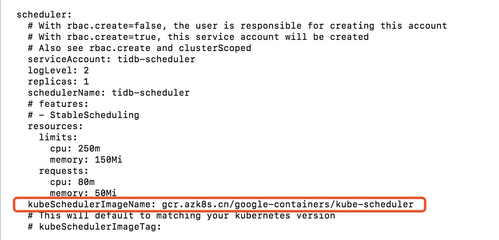
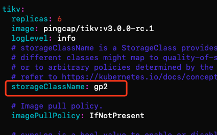
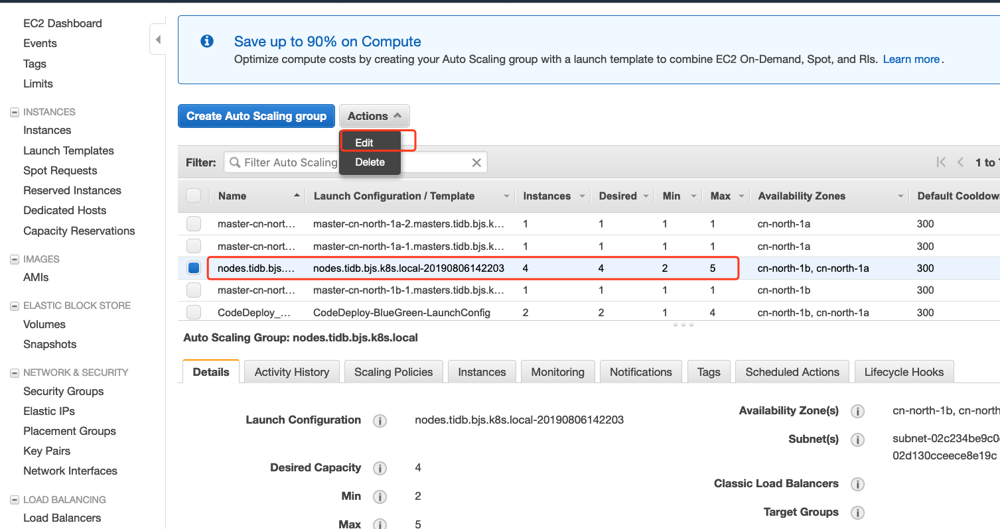
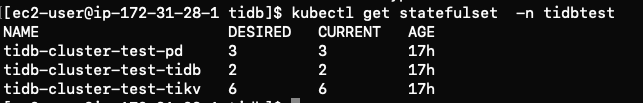
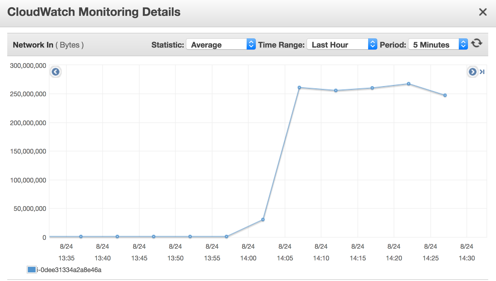
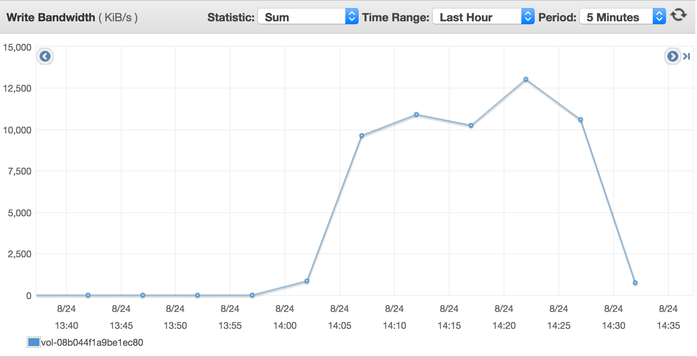
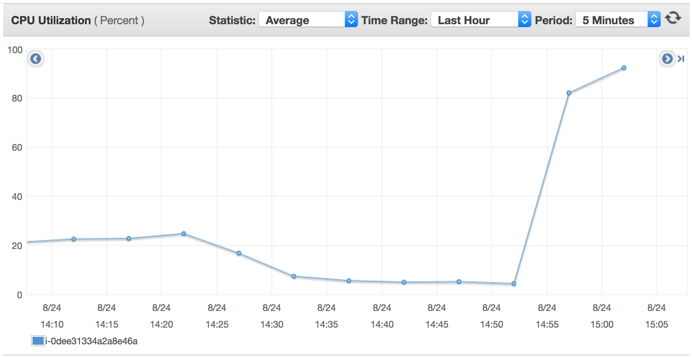

# 在AWS中国区搭建kubernetes集群部署TiDB集群并且实现动态扩展

[TiDB](https://pingcap.com/docs-cn/v3.0/overview/) 是 PingCAP 公司设计的开源分布式 HTAP (Hybrid Transactional and Analytical Processing) 数据库，结合了传统的 RDBMS 和 NoSQL 的最佳特性。TiDB 兼容 MySQL，支持无限的水平扩展，具备强一致性和高可用性。TiDB 的目标是为 OLTP (Online Transactional Processing) 和 OLAP (Online Analytical Processing) 场景提供一站式的解决方案。

TiDB提供了对AWS平台的支持，官网也有提供[guide](https://pingcap.com/docs-cn/v3.0/tidb-in-kubernetes/deploy/aws-eks/)如何利用terraform模板一键在[Amazon Elastic Kubernetes Service（EKS上）](https://aws.amazon.com/cn/eks/)中部署整套环境。然而由于中国区暂时还未上线EKS，以及这套环境是依赖模板一键启动在EKS中等限制，本文做了详细的介绍，如何利用AWS中国区账号，自己搭建kubernetes环境，部署TiDB集群并且实现TiDB集群的动态扩展。

## 内容概述
本文内容主要分为两个方面，一是如何启动kubernetes集群并且部署TiDB集群，二是集群搭建完毕后，如何实现集群的扩展。在本文的最后，也添加了一些常见问题的Troubleshooting以及已知的一些扩展方面的limits。

## 先决条件
1. 拥有AWS中国区账号，如果还没有，[点击此处注册](https://www.amazonaws.cn/sign-up/)
1. 检查账户级别的EC2 Limits，确保你的EC2 limits多于你想要部署的node的数量。如果需要更多实例，可以申请提高instance limit.

## 如何在Kubernetes上搭建TiDB集群

### 步骤1：配置堡垒机
此步骤会启动一台EC2，用于运维kubernetes集群的堡垒机。
1. 启动EC2（推荐使用Amazon Linux2 AMI)
1. IAM设置：创建一个具有特定权限的User，**下载credentials文档**或者手动记下“Access key ID”和“Secret access key”
   
   >Note: 该权限至少需要EC2相关的权限(启动EC2, auto scaling，创建并且使用EBS等)，否则无法成功启动集群。
   
1. 执行```aws configure```为EC2配置对应权限
   - AWS Access key ID:
   - AWS Secret access key:
   - Default Region name: cn-north-1
   - Default output format: none
   
>Note：cn-north-1为北京区的region code，如果用宁夏，应该配置为cn-northwest-1


### 步骤2：利用kops-cn创建kubernete集群
1. 参考[kops-cn](https://github.com/nwcdlabs/kops-cn)启动Kubernetes集群。针对TiDB集群特点，可考虑单AZ部署Kubernetes集群以实现更高性能，并降低数据传输成本。不过因此需要放弃跨AZ集群的可用性。这一点可根据您的实际需求进行权衡。
设置方法为在步骤5```make edit-cluster```当中找到create-cluster部分，根据自身需求编辑相应的zones，subnet等字段，并保存退出。
   ```buildoutcfg
   make edit-cluster

   ##找到create-cluster部分，根据自身需求编辑相应的zones, subnet等字段, 并保存退出
   create-cluster:
	  @KOPS_STATE_STORE=$(KOPS_STATE_STORE) \
	  AWS_PROFILE=$(AWS_PROFILE) \
	  AWS_REGION=$(AWS_REGION) \
	  AWS_DEFAULT_REGION=$(AWS_DEFAULT_REGION) \
	  kops create cluster \
      --cloud=aws \
      --name=$(CLUSTER_NAME) \
      --image=$(AMI) \
      --zones=cn-northwest-1a \
      --master-count=$(MASTER_COUNT) \
      --master-size=$(MASTER_SIZE) \
      --node-count=$(NODE_COUNT) \
      --node-size=$(NODE_SIZE)  \
      --vpc=$(VPCID) \
      --kubernetes-version=$(KUBERNETES_VERSION_URI) \
      --networking=amazon-vpc-routed-eni \
      --subnets=subnet-xxxxxxxxxxxx \
      --ssh-public-key=$(SSH_PUBLIC_KEY)

   make update-cluster
   ```
1. (可选选项) 如果您的AWS账号已经做过ICP备案，跳过此步；如果还没有做ICP备案，您账户下的80，8080，443端口是被屏蔽的，您需要配置以下选项更改默认端口。（如果仍需要这三个端口，请同时申请备案开放这三个端口。）
   - 登录[AWS控制台](https://console.amazonaws.cn/console/home)，在服务- EC2- 负载均衡器页面，选择~/.kube/config 当中的负载均衡器，并且更改以下配置：
      - 添加安全组策略，允许8443端口对source:0.0.0.0/0开放。
      - 点击listeners(侦听器)选项，将443端口更改成8443.
   - 编辑.kube/config文件，在server这一行的最后添加":8443"  
1. 用kubectl命令检查集群是否配置成功
1. 安装helm和tiller，[点击此处查看详细的安装文档](https://github.com/nwcdlabs/kops-cn/blob/master/doc/Helm.md)，需要将helm以及tiller可执行文件放到```/usr/local/bin/```目录下
### 步骤3：在kubernete集群安装配置TiDB
1. ssh到堡垒机,对于选择Amazon Linux镜像的用户；如选择其他镜像，请更改至对应用户名
   ```
   ssh -i <your-private-key-name>.pem ec2-user@<ip-address>
   ```
   
1. 添加pingcap到helm repo list
   ```
   helm repo add pingcap https://charts.pingcap.org/
   helm repo update
   helm search tidb
   ```
1. 安装TiDB operator
   ```
   #to create TidbCluster customized resource type:
   kubectl apply -f https://raw.githubusercontent.com/pingcap/tidb-operator/master/manifests/crd.yaml && \
   kubectl get crd tidbclusters.pingcap.com

   #to get chart yaml file of tidb-operator
   #you could customize your folder location by chaging mkdir command
   mkdir -p ~/tidb-operator && \
   helm inspect values pingcap/tidb-operator --version=v1.0.0 > ~/tidb-operator/values-tidb-operator.yaml
   
   #to modify the yaml file and specify local image repo:
   vim ~/tidb-operator/values-tidb-operator.yaml
   ```
   
   将scheduler.kubeSchedulerImage替换为国内的源，"gcr.azk8s.cn/google-containers/kube-scheduler", 并保存文件。
   

   ```
   #install tidb-operator:
   helm install pingcap/tidb-operator --name=tidb-operator --namespace=tidb-admin --version=v1.0.0  -f ~/tidb-operator/values-tidb-operator.yaml

   #verify the installation:
   kubectl get po -n tidb-admin -l app.kubernetes.io/name=tidb-operator
   ```
   > Note：需要运行tiller才可以成功执行helm操作。具体操作请参考[这里](https://docs.aws.amazon.com/zh_cn/eks/latest/userguide/helm.html)
1. 运行以下命令拿到tidb-cluster配置文件
   ```
   # fetch Tidb cluster package  
   helm fetch pingcap/tidb-cluster   

   # unzip it to get the config file
   tar -zxvf tidb-cluster-v1.0.0.tgz

   cd tidb-cluster
   ```

1. 在此文件夹下，会有一个values.yaml文件。这个是tidb-cluster的配置文件，里面包含不同组件，比如TiDB，Tikv, PD的详细定义。在启动集群之前，请您自行修改至期望的配置。比如storageclass，replicaset，pvReclaimPolicy等等。下面是一些sample。
   - 将storageclass修改为gp2（一种EBS卷类型）。如您不了解EBS, 请参考[EBS卷类型的定义和区别](https://docs.aws.amazon.com/zh_cn/AWSEC2/latest/UserGuide/EBSVolumeTypes.html)获取更多信息。      
    
    > 【重要】: 对于只支持EBS的实例类型，如c4,c5等，我们需要将所有默认的local-instance更改至一种EBS类型。请点击[EC2实例类型介绍](https://aws.amazon.com/ec2/instance-types/)，如果您不了解您选择的实例类型。
   
   - 更改replica的数量   
   

1. 在确保已经自定义完所有所期望的配置后，运行以下安装命令。 namespace和name可自行替换。
   ```
   helm install pingcap/tidb-cluster --name=tidb-cluster-test --namespace=tidbtest -f values.yaml 
   ```
1. 验证集群。此时pod已经按照replicaset处的要求成功启动，PV和PVC应已采取dynamic的方式分配成功。可以用```kubectl get pv | grep tidbtest```查看pv是否创建成功，此时也可至控制台查看EBS卷的创建。有关于PV，可点击[K8s的PV分配](https://kubernetes.io/docs/concepts/storage/persistent-volumes/)查看更多信息。
   
   
### 步骤4：部署后，如何访问TiDB
#### 查看集群状态
1. 查看tidb-cluster创建
   ```
   watch kubectl get pods --namespace tidbtest -l app.kubernetes.io/instance=tidb-cluster-test -o wide
   ```
1. 列举tidb-cluster的服务
   ```
   kubectl get services --namespace tidbtest -l app.kubernetes.io/instance=tidb-cluster-test
   ```
#### 访问集群
1. 利用MySQL客户端访问TiDB集群

   - 在kubectl client本机通过mysql客户端访问：
      ``` 
      kubectl port-forward -n tidbtest svc/tidb-cluster-test-tidb 4000:4000 &
      mysql -h 127.0.0.1 -P 4000 -u root -D test
      ```
   - 通过四层网络可达的任意mysql client访问：
  
     ``` 
     #查看当前tidb service的nodeport信息
     kubectl get svc -n tidbtest
     
     #找到对应的tidb条目，如tidb-cluster-1-tidb  NodePort   10.100.20.254   <none>     4000:31726/TCP,10080:31651/TCP   82m
     #确认主机端口为31726. 通过mysql client访问：
     mysql -h <any host ip from Kubernetes worker nodes> -P 31726 -u root -D test 
     ``` 
   
1. 为用户创建密码
   ```buildoutcfg
   SET PASSWORD FOR 'root'@'%' = 'JEeRq8WbHu'; FLUSH PRIVILEGES;
   ```
1. 为TiDB集群创建监控dashboard
   ```
   kubectl port-forward -n tidbtest svc/tidb-cluster-test-grafana 3000:3000
   ```
   打开浏览器用http://<ip-address>:3000 访问。默认的用户名和密码为admin/admin.
      
## 如何扩展Kubernetes集群中TiDB
这个section主要介绍如何扩展TiDB。

1. **手动扩展Kubernetes Worker Node数量**     

   在 [AWS EC2 Console](https://console.amazonaws.cn/ec2/autoscaling/home)中查看**Auto Scaling Group(ASG)**. 您可以自定义此ASG的最小值，最大值以及当前期望值。如果希望扩展node的数量，只需要更改期望值即可。另外，我们也可以设置规则，使得ASG可以在满足特定条件时（比如，当集群EC2的CPU平均利用达到80%时）自动扩展。但TiDB集群对这一层的扩展无感知。 
   
   
1. **手动扩展Pod数量**  
   
   在确保node数量足够的情况下，扩展pod数量，只需要在yaml文件中修改对应组件的replicaset即可。修改完毕后运行以下指令。如果storageclass的配置没错，PV和PVC会自动创建。如果Kubernetes Worker Node剩余资源无法满足所有新扩pod的需求，部分pod会一直处于pending状态，此时可通过执行上一步：**手动扩展Kubernetes Worker Node数量** 来解决。
   ```
   helm upgrade tidb-cluster-test pingcap/tidb-cluster --namespace=tidbtest -f values.yaml 
   ```
   

1. **基于Cluster Autoscaler实现Node和pod依次自动扩展**   
   在上述两步中，我们均通过手动的方式，实现了集群的扩展。我们也可以通过配置 **Cluster AutoScaler(CA)** 实现半自动的动态扩展，即如果手动修改pod数量，node数量不够时，CA会自动启动node，并且在node创建成功后实现pod的自动部署。以下为详细步骤   
   
   - 有关于CA在kubernetes上的配置步骤，可点击[此文档的说明](https://eksworkshop.com/scaling/deploy_ca/)查看.  **不需要做Scale deployment这一步** 。
   - 对于中国用户，需要修改镜像地址为中国国内的镜像 ```gcr.azk8s.cn/google-containers/cluster-autoscaler:v1.2.2```，否则拉取不起来。
   
   - 此时，再次修改yaml文件为desired count。下图为示例截图，可以看到新的node已经创建成功。
   
   
   
## 删除资源
可根据需求自行删除namespace, pod，node等，留意如果您的pvReclaimPolicy设置的为Retain, 在pod删除后，pv不会自动删除，您需要手动删除EBS卷或者通过```kubectl delete pv ```命令来删除

## Troubleshooting
1. **Error: trying and failing to pull image error**   
此error的常见原因是，中国block了google的源，所以需要将google的源替换为国内的源。比如gcr.azk8s.cn/google-containers等等。

1. **Error: cannot find tiller**
- tiller执行文件在helm的压缩包当中，需要将helm可执行文件移到```/usr/local/bin/```目录下
- 每次在您想要为集群使用 helm 时重复[本地运行 helm 和 tiller](https://docs.aws.amazon.com/zh_cn/eks/latest/userguide/helm.html)的过程

1. **启动新资源失败**   
检查账户EC2 limits。确保有足够的limit可以启动期望数量的EC2。如果实例数量不够，请点击请求限额资源。
   
   
1. **PV创建失败**    
检查storageclass的定义。
   - 对于只支持EBS的实例类型，如c4,c5等，我们需要将所有默认的local-instance更改至一种EBS类型，常用的是标准的SSD gp2；否则PV会因为没有可用的实例存储而创建失败。
   - 对于含有instance storage的实力类型，比如i3等等，可以选择local storage或者ebs实例类型。根据[此文](https://pingcap.com/docs-cn/v3.0/tidb-in-kubernetes/deploy/prerequisites/)的建议,因为 TiKV 组件的性能很依赖磁盘 I/O 且数据量一般较大，因此建议每个 TiKV 实例独占一块 NVMe 的盘.
   - 如果不清楚不同instance type之间的区别，点击[此文档](https://aws.amazon.com/ec2/instance-types/)查看


## 已知限制
根据[此页面提供的信息](https://pingcap.com/docs-cn/v3.0/tidb-in-kubernetes/faq/#tidb-%E7%9B%B8%E5%85%B3%E7%BB%84%E4%BB%B6%E5%8F%AF%E4%BB%A5%E9%85%8D%E7%BD%AE-hpa-%E6%88%96-vpa-%E4%B9%88)，TiDB不支持[HPA(Horizontal Pod Autoscaling)](https://eksworkshop.com/scaling/deploy_hpa/) or VPA(Vertical Pod Autoscaling)。原因是TiDB作为一个数据库应用，其核心组件都是有状态的，采用了statefulset来部署。对于有状态的应用，靠CPU或者内存这些简单的指标是很难直接扩展的。   


## 压力测试：

采用sysbench工具对该cluster做模拟压力测试。   
>注：本部分旨在从功能性上完成TiDB on Kubernetes的压力测试场景，不涉及性能优化。
>如需达到更高性能，建议从以下几个方向考虑：1. 采用instance store作为tikv PV空间；2. Worker node采用高级实例；3. 集群单AZ部署； 4. 参照TiDB文档为各Worker node配置优化的系统参数（inode等）
>mysql client及sysbench的安装过程不在本文中展开, 可参考[如何用 Sysbench 测试 TiDB](https://pingcap.com/docs-cn/v3.0/benchmark/how-to-run-sysbench/)进行配置。

1. 按照步骤4所述连接tidb集群并创建DB：   
   ```
   mysql> create database mydb1;
   mysql> exit;
   ```
1. 写性能测试
   ```
   ./sysbench --test=/home/ec2-user/sysbench/sysbench/tests/db/oltp.lua --mysql-host=10.100.12.90 --oltp-tables-count=250 --mysql-user=root --mysql-password=<mypassword> --mysql-port=31726 --oltp-table-size=25000 --mysql-db=mydb1 --db-driver=mysql prepare
   ```
   此时通过CloudWatch观察Kubernetes worker node节点以及tikv的PV卷所对应的EBS性能指标，可发现磁盘写throughput压力较大，符合预期

   
   
   
   

1. OLTP性能测试
   ```
   ./sysbench --test=/home/ec2-user/sysbench/sysbench/tests/db/oltp.lua --mysql-host=10.100.12.90 --oltp-tables-count=250 --mysql-user=root --mysql-password=<mypassword>  --mysql-port=31726 --db-driver=mysql --oltp-tablesize=25000 --mysql-db=mydb1 --max-requests=0 --oltp_simple_ranges=0 --oltp-distinct-ranges=0 --oltp-sum-ranges=0 --oltp-order-ranges=0 --maxtime=600 --oltp-read-only=on --num-threads=50 run
   ```
   通过CloudWatch观察相关资源，发现两个node出现cpu瓶颈。由于本次模拟50个并发的OLTP读写业务，对tidb组件的性能压力较大，而tidb仅两个pod，对应的两个node的CPU出现瓶颈，符合预期。

   


## 参考资料
* [Pingcap](https://pingcap.com/docs-cn/dev/tidb-in-kubernetes/tidb-operator-overview/)
* [AWS EKS workshop](https://eksworkshop.com/scaling/)
* [利用Terraform在AWS EKS上一键部署terraform](https://pingcap.com/docs-cn/v3.0/tidb-in-kubernetes/deploy/aws-eks/)
* [Cluster autoscalor on AWS](https://github.com/kubernetes/autoscaler/blob/master/cluster-autoscaler/cloudprovider/aws/README.md)
* [Run Sysbench on TiDB](https://pingcap.com/docs-cn/v3.0/benchmark/how-to-run-sysbench/)