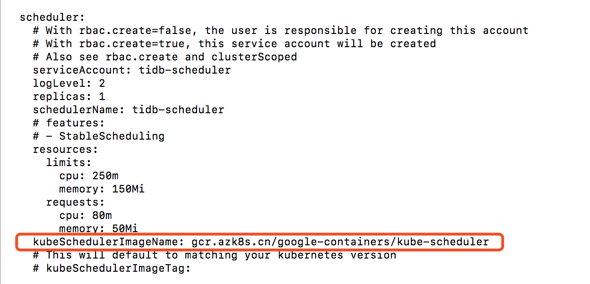
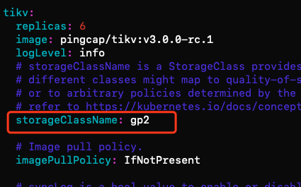
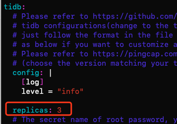
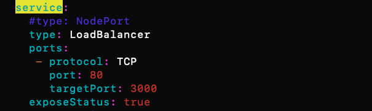
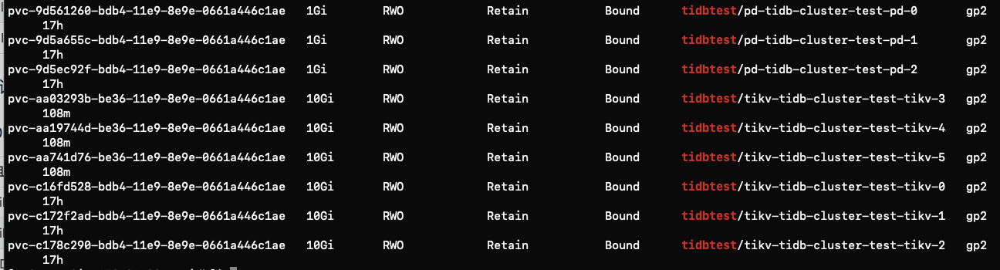
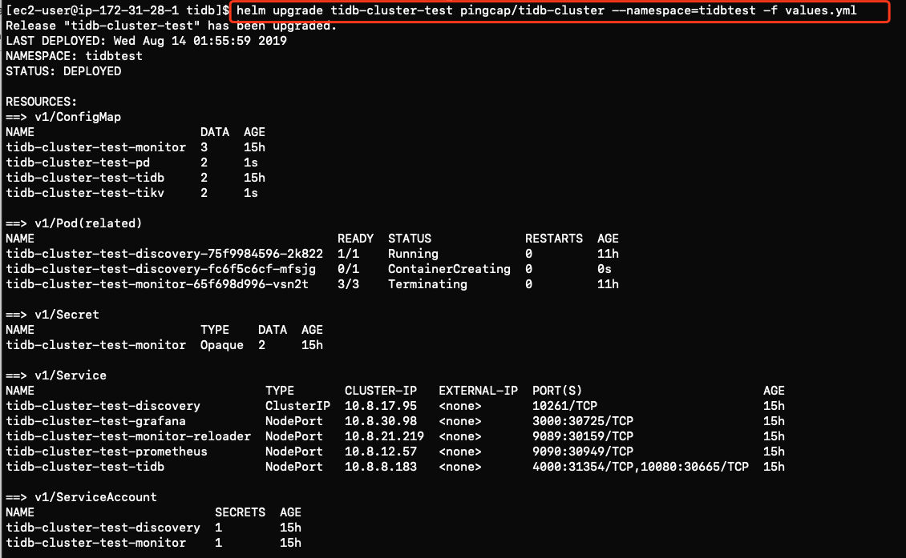
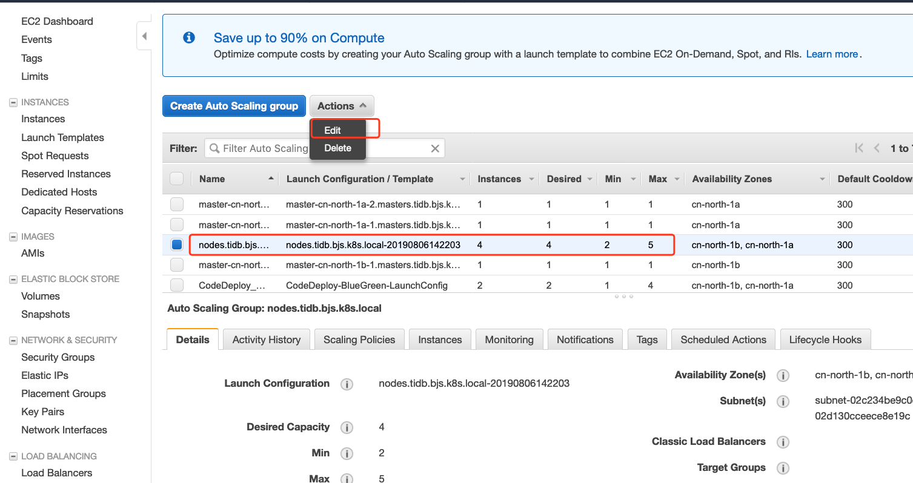
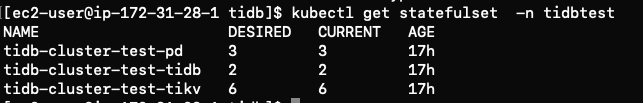

#	How to setup TiDB on kubernetes cluster by kops in AWS China 

This document provides guides to deploy TiDB in k8s in AWS China using [kops-cn](https://github.com/nwcdlabs/kops-cn). 

##	Pre-requisites
1.  Have a AWS China account. If you don't have one, [click here to register](https://www.amazonaws.cn/en/sign-up/)
1.  Launch an EC2 (recommend selecting Amazon Linux 2 AMI) as a kubernetes management machine, and configure it as below.
    1. Login [AWS China console](https://console.amazonaws.cn/console/home)  
   
    1. (Optional: group setting) Go to Services->IAM->Group, add a new group (e.g kubernetes) with necessary permissions attached (we simply use “AdministratorAccess” in this blog for quick start, but it's not recommended in production environment. Better follow [least privileges rules](https://docs.aws.amazon.com/IAM/latest/UserGuide/best-practices.html#grant-least-privilege) in policy setting).

    1. Go to Services->IAM->Users, create a new user (e.g. kops) with "Programmatic access" enabled and add it into the newly created group (e.g. kubernetes). After that, you will get the “Access key ID” and “Secret access key”. Download the credential document or write them down for future use;

    1. Login the EC2, and perform the “**aws configure**”. It will ask you to input the following information. 
        - AWS Access key ID: <created above>
        - AWS Secret access key: <created above>
        - Default Region name: cn-north-1  
        - Default output format: none
        >Note: cn-north-1 is the region code for Beijing region, for Ningxia, it's cn-northwest-1  

## Step 1: Setup a kubernete cluster uing kops-cn

We have a well-written document by Pahud about how to set kubernete cluster using kops in China.  
1. For Chinese version, go to [kops-cn-chinese-version](https://github.com/nwcdlabs/kops-cn) 
1. For English version, go to [kops-cn-english-version](https://github.com/nwcdlabs/kops-cn/blob/master/README_en.md)
   > Note: For kops and kubectl package, remember to replace the binary download link with China S3 bucket address to avoid suffering from low speed issue.
   > It is noted in kops-cn document [HOW TO section step 2](https://github.com/nwcdlabs/kops-cn/blob/master/README_en.md#HOWTO) .

1. (Optional) If your AWS account hasn't finished **ICP recordal whitelist** for the public web service which is required by China government, you still need to perform the following steps. **Skip this part if your AWS account has been added to ICP whitelisted**.

   1. Login AWS China console and go to Services->EC2->Load Balancer, and select the the load balancer according to the .kube/config and make some changes:
      1. Add a rule into the security group to allow 8443 TCP traffic from 0.0.0.0/0 source;
      1. Click on the “Listeners” tab and change the “Load Balancer Port” from 443 to 8444
   1. Edit .kube/config by appending “:8443” at end of line “server: https://xxxx”

1. Now, the kubernetes cluster is ready, and you can operate it by kubectl

1. You will also need to install extra tools like helm. Check here for [detailed installation steps](https://github.com/nwcdlabs/kops-cn/blob/master/doc/Helm.md).

## Step 2: install TiDB on kubernete cluster

1. Ssh to the bastion server. If you are using Amazon AMI,  ssh -i < name-of-your-private-key >.pem  ec2-user@< ip-address > . For other linux type, try centos or ubuntu for the username.

1. If you haven't **install helm**, refer to [Helm Installation](https://docs.aws.amazon.com/eks/latest/userguide/helm.html) for Helm installation. Skip this step if you have finished helm installation.

1. After helm,'s installtion, run ```helm init -i registry.cn-hangzhou.aliyuncs.com/google_containers/tiller:v2.14.1 --stable-repo-url https://kubernetes.oss-cn-hangzhou.aliyuncs.com/charts --service-account tiller``` to init.

1. Add Pingcap into the Helm repo list.
    ```
    helm repo add pingcap https://charts.pingcap.org/
    helm repo update
    helm search tidb
    ```
    
1. Install Tidb Operator

   ```
   #to create TidbCluster customized resource type:
   kubectl apply -f https://raw.githubusercontent.com/pingcap/tidb-operator/master/manifests/crd.yaml && \
   kubectl get crd tidbclusters.pingcap.com
   
   #to get chart yaml file of tidb-operator
   #you could customize your folder location by chaging mkdir command
   mkdir -p ~/tidb-operator && \
   helm inspect values pingcap/tidb-operator --version=<chart-version> > ~/tidb-operator/values-tidb-operator.yaml
   
   #to modify the yaml file and specify local image repo:
   vim ~/tidb-operator/values-tidb-operator.yaml
   
 
   ```
 1. set the value of 'scheduler.kubeSchedulerImage' to 'gcr.azk8s.cn/google-containers/kube-scheduler', and save the file.  
   
   
   ```
   #set the value of 'scheduler.kubeSchedulerImage' to 'gcr.azk8s.cn/google-containers/kube-scheduler', and save the file.
   #install tidb-operator:
   helm install pingcap/tidb-operator --name=tidb-operator --namespace=tidb-admin --version=v1.0.0  -f ~/tidb-operator/values-tidb-operator.yaml
   
   #verify the installation:
   kubectl get po -n tidb-admin -l app.kubernetes.io/name=tidb-operator

   ```
   
1. Run the following command

    ```
    # fetch Tidb cluster package  
    helm fetch pingcap/tidb-cluster   

    # unzip it to get the config file
    tar -zxvf tidb-cluster-v1.0.0.tgz

    cd tidb-cluster
    ```
    
1. There is a values.yml file in this folder which contains the configuration set for components like TiKV, pd, TiDB etc. **Custom your own configuration by revising the yml file** before you install TiDB, examples of changes includes revise replica set, set a ELB, change pvReclaimPolicy or revise the storageClassName etc.    

    - Changing storageclass to gp2, AWS EBS volume General SSD. For more choices, click [EBS Volume type](https://docs.aws.amazon.com/zh_cn/AWSEC2/latest/UserGuide/EBSVolumeTypes.html)   

        

    - changing component replica number   
        

    - change nodeport to AWS Load balancer
        
        
1. After everything is set, run the following command.

    ```
    helm install pingcap/tidb-cluster --name=tidb-cluster-test --namespace=tidbtest -f values.yml 
    ```

1. Check the cluster configuration. For example, you will see the storageClass applies succesfully to gp2 and PV has automatically been provisioned dynamically. Click here for more introduction upon [PV provision](https://kubernetes.io/docs/concepts/storage/persistent-volumes/).
Also, if you go to [AWS Console](https://console.amazonaws.cn/ec2/autoscaling/home) now , you will find EBS GP2 volumes provisioned automatically.
    ```
    kubectl get pv | grep tidbtest
    ```

   


## Step3. Scale on kubernete cluster
This section enables you to scalue the cluster up or down.

1. If you would like to scale up or down your pod replica number, simple revise the values.yml and run the following command. For more guide upon scaling, refer to [this page](https://github.com/pingcap/docs-cn/blob/master/v3.0/tidb-in-kubernetes/scale-in-kubernetes.md)

   ```
   helm upgrade tidb-cluster-test pingcap/tidb-cluster --namespace=tidbtest -f values.yml 
   ``` 

   You will see this after the command.

   

1. If you would like to scale up or down your Node nunber, go to [AWS EC2 Console](https://console.amazonaws.cn/ec2/autoscaling/home) and **Configure your auto scaling group**. You could edit the min, max and desired number for current state and also configure metircs to let the node scale automatically. For example, scale when CPU reaches 80%.
   


## Step 4: How to access TiDB 

###	Cluster Startup
1. Watch tidb-cluster up and running
    ```
    watch kubectl get pods --namespace tidbtest -l app.kubernetes.io/instance=tidb-cluster-test -o wide
    ```
1. List services in the tidb-cluster
    ```
    kubectl get services --namespace tidbtest -l app.kubernetes.io/instance=tidb-cluster-test
    ```

###	Cluster access

1. Access tidb-cluster using the MySQL client
    ```  	
    kubectl port-forward -n tidbtest svc/tidb-cluster-test-tidb 4000:4000 &
    mysql -h 127.0.0.1 -P 4000 -u root -D test
    ```
1. Set a password for your user

    ```
    SET PASSWORD FOR 'root'@'%' = 'JEeRq8WbHu'; FLUSH PRIVILEGES;
    ```    
1. View monitor dashboard for TiDB cluster

   ```
   kubectl port-forward -n tidbtest svc/tidb-cluster-test-grafana 3000:3000
   ```   

1. Open browser at http://localhost:3000. The default username and password is admin/admin.
If you are running this from a remote machine, you must specify the server's external IP address.

## Delete resources

If your pv is retained, after the scale down, you may need to delete the released pv manually by running the following command.

  ```
  kubectl delete pv pvc-2eb80d98-bd7XXXc1ae  -n tidbtest
  ```

## Limitation

According to [this page](https://pingcap.com/docs-cn/v3.0/tidb-in-kubernetes/faq/#tidb-%E7%9B%B8%E5%85%B3%E7%BB%84%E4%BB%B6%E5%8F%AF%E4%BB%A5%E9%85%8D%E7%BD%AE-hpa-%E6%88%96-vpa-%E4%B9%88), TiDB cluster hasn't supported HPA(Horizontal Pod Autoscaling) or VPA(Vertical Pod Autoscaling). The reason is because Tidb cluster uses statefulset instead of deployment as database is a stateful application and it's hard for a stateful application to scale simply based on CPU or memories.



## Testing
Please refer to this page for [run sysbench on TiDB](https://github.com/pingcap/docs/blob/master/dev/benchmark/sysbench-v4.md)

## References

* [Pingcap](https://pingcap.com/docs-cn/dev/tidb-in-kubernetes/tidb-operator-overview/)
* [AWS EKS workshop](https://eksworkshop.com/scaling/)
* [kubernetes Concept introduction](https://kubernetes.io/docs/concepts/storage/persistent-volumes/)

